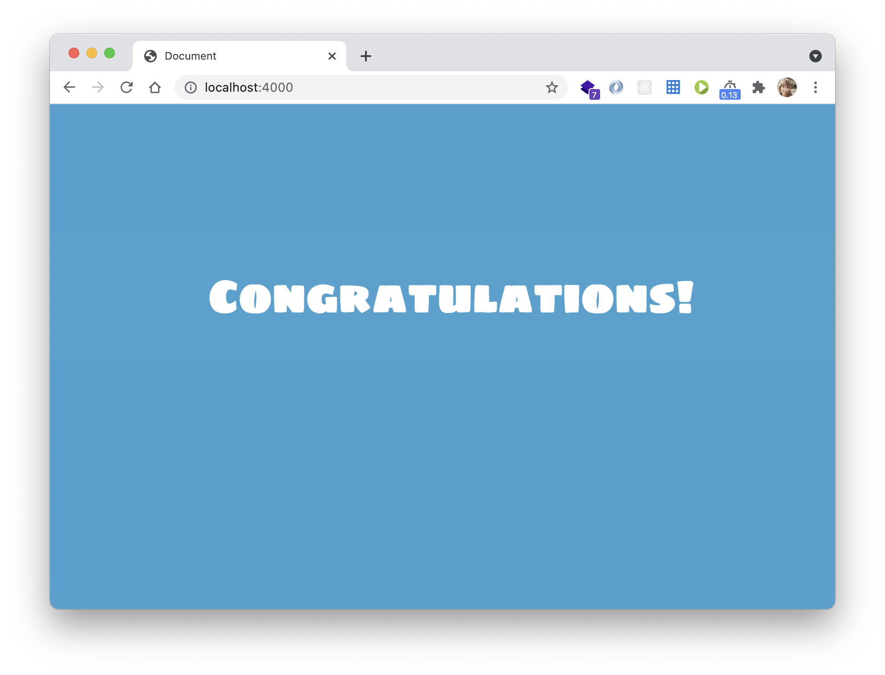

# Clase 4 - Docker

### Ejercicio 1 - Containerizar aplicacion `Node.js`

Dockeriza la carpeta [hello-bootcamp](https://raw.githubusercontent.com/roxsross/bootcamp-3-challenge/master/reto5/hello-bootcamp/index.html)
Antes de hacerlo __¡pruébala en local!__
Genera la imagen con el __VS Code__

- Ejecuta un contenedor con la imagen

- Subir la aplicacion en registry

- Crear el Script que permita realizar todo lo antes mencionado

__NOTA:__ Con el fin de realizar un entregable sencillo, sin entrar en automatizacion de GUI, todas las operaciones se realizarán usando la __shell__, en vez de __VS Code__

Resultado:

### Entregable:

- Armar una solucion.md y usando Markdown :

- Documentacion [Markdown](https://docs.github.com/es/get-started/writing-on-github/getting-started-with-writing-and-formatting-on-github/basic-writing-and-formatting-syntax)

- Crear Dockerfile

- Subir Registry DockerHub