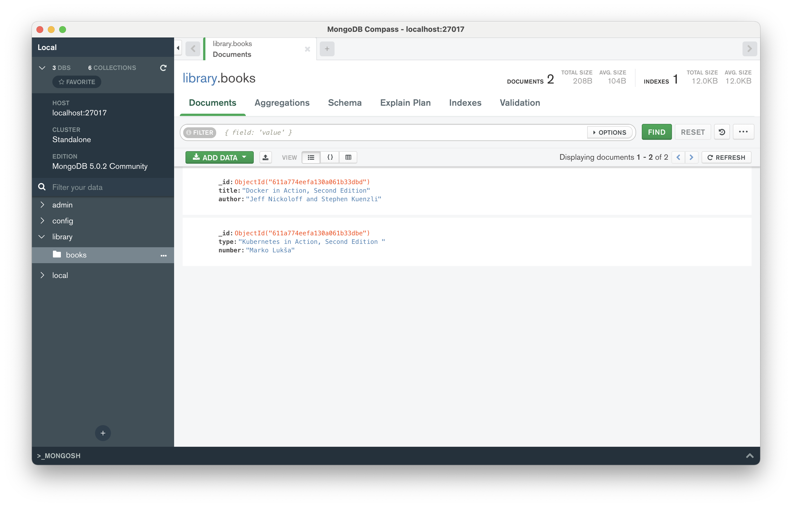
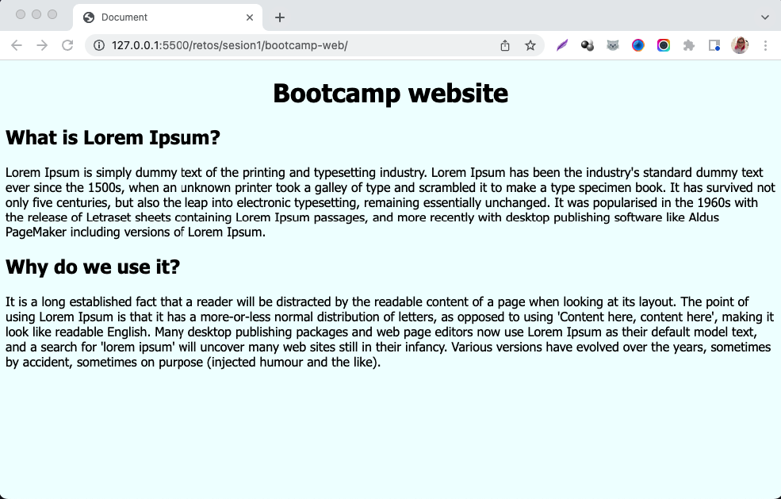
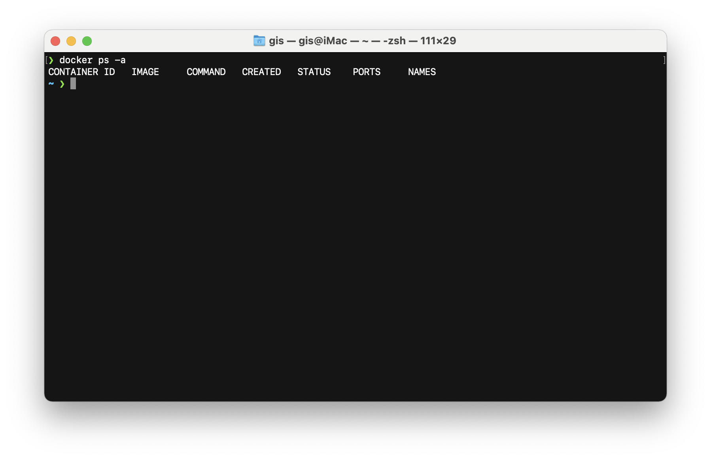
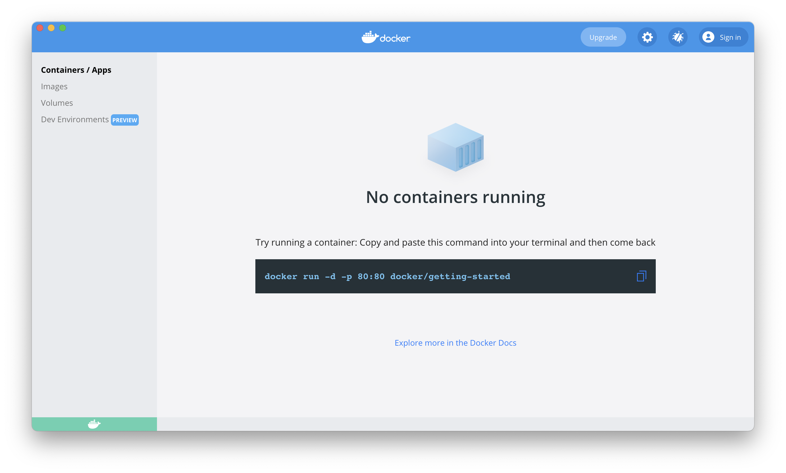

# Clase 4 - Docker

### Ejercicio 1 - Crear contenedores de `MongoDB` y `MongoDB Express`

Crea un contenedor con `MongoDB`, protegido por usuario y contraseña.
Conectate utilizando `Mongo Compass`.
Crea una base de datos llamada `Library` con una colección llamada `Books`.

Importa los datos de [books.json](https://raw.githubusercontent.com/roxsross/bootcamp-3-challenge/master/reto6-bonus/books.json) en el directorio de la unidad.

__Nota:__ Se ha reemplazado `Mongo Compass`, que es una aplicación de escritorio, por `Mongo Express`, que es una aplicacion web. La razón es que es más sencillo de testear y se consigue el mismo objetivo.

### Ejercicio 2 - Crear contenedor `Nginx`

Crea un contenedor llamado `bootcamp-web`, con `Nginx`, accesible desde `http://localhost:9999 `

Copia el contenido de la carpeta [bootcamp-web](https://github.com/roxsross/bootcamp-3-challenge/master/reto6-bonus/bootcamp-web) de la unidad en la ruta que sirve este servidor.

Ejecuta `ls` desde fuera para ver que el contenido se ha copiado correctamente.

Accede a través del navegador de tu máquina.

### Ejercicio 3 - Limpiar sistema

Eliminar todos los contenedores que tienes ejecutándose en tu máquina.

### Entregable:

- Armar una solucion.md y usando Markdown :

- Documentacion [Markdown](https://docs.github.com/es/get-started/writing-on-github/getting-started-with-writing-and-formatting-on-github/basic-writing-and-formatting-syntax)

- Crear Dockerfile, Subir Registry DockerHub, ademas de crear un script para el despliegue