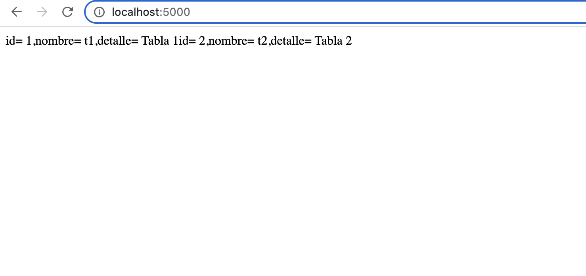

# Clase 4 - Docker

### Proyecto en Python Flask

Hay 1 aplicacion en este proyecto:

- La aplicacion se compone de un Backend en el que se conecta a una base de datos Relacional "Postgress"

- El Desafio es crear el docker-compose.yaml para desplegar la aplicacion

- Tomen en cuenta que primero deben contruir antes de desplegar

- Tanto el Backend y la BD cuenta con un Dockerfile, revisenlo si le hace falta mejorarlo

### Entregable

- Documentación de la solucion

- docker-compose.yaml

- Mejoras

### Resultado 

